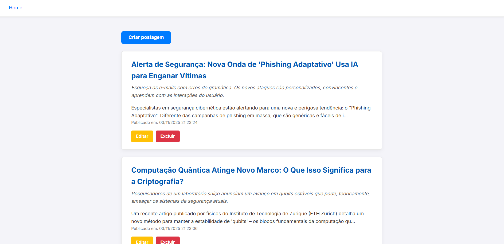
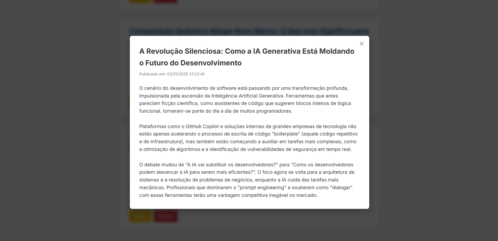
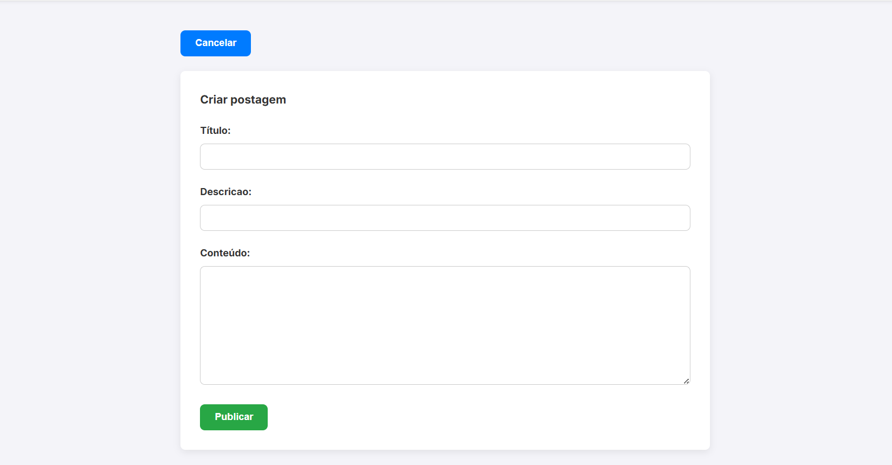
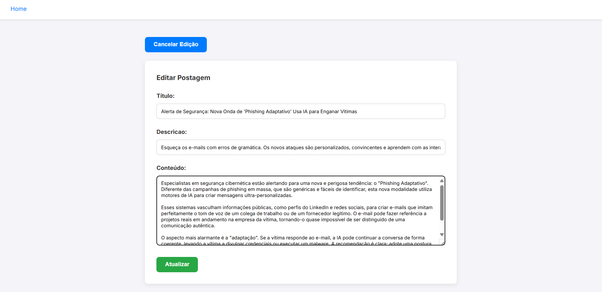

<h1 align="center">Blog </h1>

Sistema de blog criado prática de conceitos de banco de dados utilizando a linguagem PHP e MySQL

# ✔️ Técnicas e tecnologias usadas
- ``Visual Studio Code``
- ``HTML5``
- ``CSS3``
- ``PHP``
- ``JavaScript``
- ``Orientação ao Objeto``
- ``MySQL``

## 🚀 Demonstração

Aqui está uma visão geral de como a aplicação funciona.

### Visão Geral

### Modal de Leitura
O usuário pode clicar em um post para abri-lo em um modal.

### Criação de postagem

### Edição de postagens

# Autores

 Murilo Henderson
